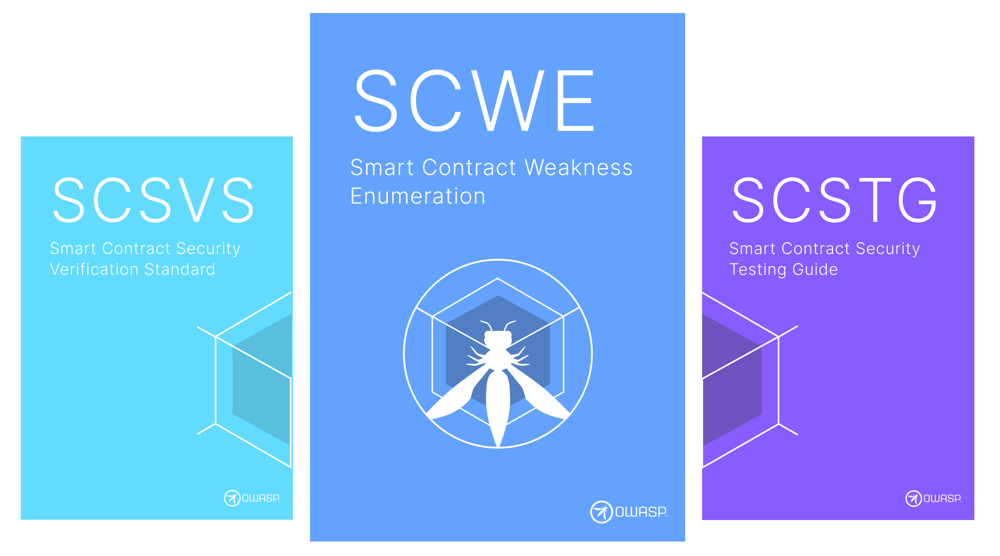

<a href="https://github.com/OWASP/www-project-smart-contract-security-testing-guide/"><!-- :material-github: -->GitHub リポジトリ (英語)</a>

<a href="https://owasp.org/www-project-smart-contract-security-testing-guide"><!-- :material-web: -->OWASP プロジェクトページ (英語)</a>

### ??? 情報 "SCWE について"

スマートコントラクト脆弱性タイプ一覧 (SCWE) はスマートコントラクトにおける一般的なセキュリティおよびプライバシーの脆弱性のリストです。開発者、セキュリティ研究者、セキュリティ専門家向けのリファレンスとして使用されることを目的としています。[SCSVS](../SCSVS) と [SCSTG](../SCSTG) の間の橋渡しとして機能します。

その定義については、コミュニティにより開発された一般的なソフトウェアセキュリティ脆弱性のリストである [共通脆弱性タイプ一覧 (Common Weakness Enumeration (CWE))](https://cwe.mitre.org/) から着想を得ています。SCWE は **CWE の補完リスト** となることを目指しており、特にスマートコントラクトのセキュリティ脆弱性に焦点を当てています。

**脆弱性 (weakness)** とはスマートコントラクトに導かれた可能性のあるセキュリティまたはプライバシーの問題です。脆弱性は SCSVS のカテゴリとコントロールでカテゴライズされています。たとえば、安全でない乱数生成ジェネレータの使用に関連する脆弱性は `SCSVS-CODE-1` コントロールにカテゴライズされます。

各脆弱性には以下の情報を含みます。

- **概要**: 脆弱性の簡単な説明。
- **影響**: 脆弱性がアプリケーションのセキュリティまたはプライバシーに及ぼす潜在的な影響。
- **導入モード**: 脆弱性がアプリケーションに導かれた可能性のある方法。
- **緩和策**: 脆弱性を緩和するための推奨事項。

> **"Weakness と Vulnerability"**: **Weakness は Vulnerability ではない** ものの、Vulnerability の導入につながる可能性があります。[CWE](https://cwe.mitre.org/documents/glossary/#Weakness) によると、Weakness とは、ソフトウェア、ファームウェア、ハードウェア、サービスコンポーネントの状態であり、特定の状況下では Vulnerability の導入につながる可能性があります。一方 Vulnerability とは、ソフトウェア、ファームウェア、ハードウェア、サービスコンポーネントの欠陥であり、悪用される可能性のある Weakness によって生じ、影響を受ける単一または複数のコンポーネントの機密性、完全性、可用性に悪影響を引き起こします。

### ??? 情報 "新しい SCWE 投稿の募集"

**新しい SCWE エントリを投稿しませんか？**

- [GitHub リポジトリ](https://github.com/OWASP/owasp-scs/issues) で、提案する SCWE-XXX 識別子と簡単な説明を添えて、issue を作成してください。
- 承認とメタデータの割り当て後、新しい SCWE エントリをプルリクエストとして送信してください。
- [こちらの投稿プロセス](https://pad.riseup.net/p/r.f55dffbdfba1847645dbda2f2f7f084c) 全文をご覧ください。
- 有効な投稿例としては [こちらのサンプル issue](https://github.com/OWASP/owasp-scs/issues/12) と [こちらのサンプル PR](https://github.com/OWASP/owasp-scs/pull/14) をご覧ください。

> スマートコントラクトのセキュリティ向上にご協力いただきありがとうございます！
